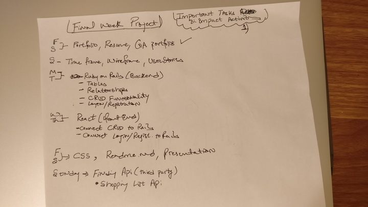
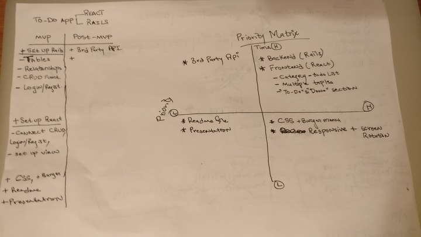
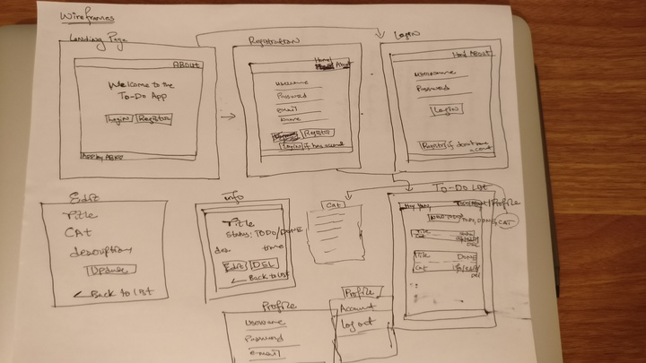
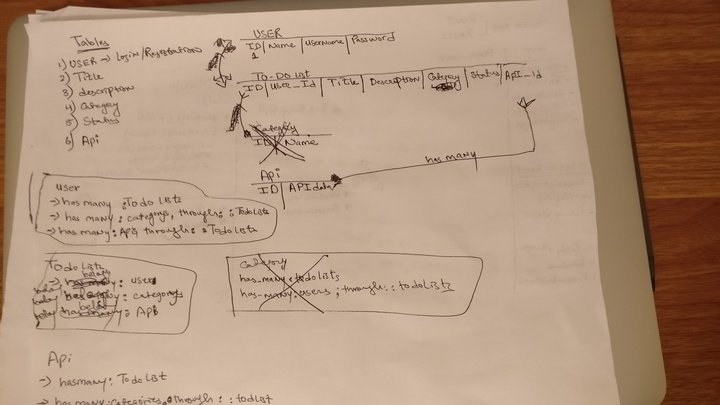
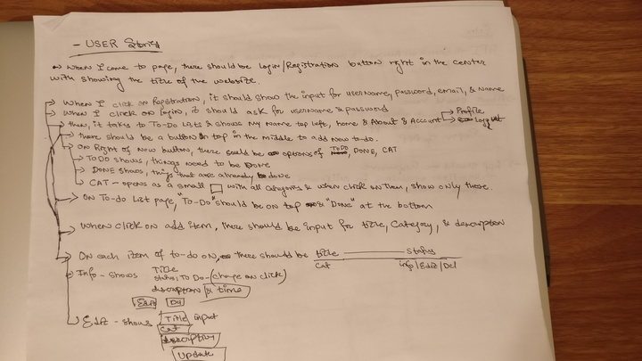
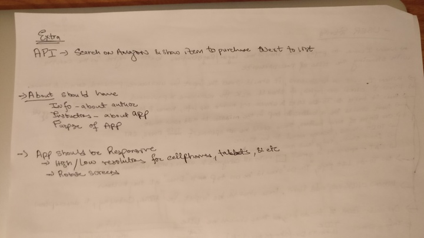

# Project Overview
Deployed on Heroku - https://todolistsga.herokuapp.com/

## Project Description

This is a ToDo app which lets you save your todo list one by one. You can add, edit and delete your list and you can also categorize them for your convenience. There is a login and registration option, so each user has his/her own privacy. And whenever you are done with todo item, you can change the status or delete it permanently.   

## Installation
- Fork it to your github account!
- Clone it to your local machine!
- Inside the project directory on the terminal, type `rails db:create db:migrate db:seed` - if it doesn't work try separately i.e., `rails db:create` in order.
- Type `rails s` to start the server and go to `http://localhost:3000/` 

## TimeFrame


## Priority Matrix & MVP & Post-MVP
  

## Wireframes


## Table and Relationships


## User Stories



# Project Management
### ToDo 
- Build Frontend in React
- Get Amazon API

### InProgress
- Clickable 'To Do' and 'Done' on Index Todolists

### Complete
####  --- Migrations ---
##### Users
- name
- username
- password
##### Todo Lists
- References to user
- title
- description
- References to category
- status 
##### Seed
####  - - - Models - - -
##### User
- has_many :todo_lists
##### TodoList
- belongs_to :user
##### TodoList
- belongs_to :user
####  - - - Controllers - - -
##### User
- Index - for testing
- Show by ID
- Create and new method
- Destroy method 
- Update method
##### TodoLists 
- Index
- Show by id
- Create and new method
- Update method
- Destroy method
##### Categories 
- Index
- Show by ID
####  - - - Routes - - -
- Look Below
####  - - - Views - - -
##### Users
- Index view
- Show by ID
- Edit 
- New
- Form
##### Todolists
- Index view 
- Show by ID 
- Edit
- New
- Form
##### Categories
- Index view
- Show by ID
####  - - - Authentication & Authorization  - - -
- Users
- Todolists
####  - - - CSS  - - -
### Issue
- Rendering the status_form on the Todolists Index and passing the todolist's ID.
## Routes..
- /users/new    - Create new user
- /users/2      - Specific User by ID
- /users/2/edit - Edit User Information

- /users/2/todoLists       - Specific User ALL Todolists
- /users/2/todoLists/2     - Specific User Specific Todo list
- /users/2/todoLists/2/edit- Edit Specific User Specific Todo list
- /users/2/todoLists/new   - New Specific User Specific Todo list

- /users/2/categories        - Specific User All Categories
- /user/2/categories/2       - Specific User Specific Category
- /users/2/categories/2/edit - Edit Specific User Specific Category
- /users/2/categories/new    - New Specific User Specific Category

## Functional Components
| Feature | Priority | Estimated Time | Time Invetsted | Actual Time |
| --- | :---: |  :---: | :---: | :---: |
| Project Planning | H | 1 day | 8 hrs |  |
| Rails - Backend | H | 2 days | 3.5 days |  |
| CSS | H | 2 day | 2.7 days |  |

## Code Snippet
 ```
 Categories Controller - Index
 
 @todolists = Todolist.where(user_id: current_user.id).all.group_by(&:category)
        
@todolists_count = Todolist.where(user_id: current_user.id).all.group(:category).count

Categories Controller - Show

@category = Todolist.where(category: params[:id],user_id: current_user.id)
```  

## Additional Gem
 ```gem 'devise'``` User Authentication and Authorization 

## Issues and Resolutions
#### 
**ERROR**: `PG::UndefinedTable: ERROR:  relation "categories" does not exist`                               
**RESOLUTION**: Deleted the `foreign_key: true` from `t.references` values

**ERROR**: `PG::UndefinedColumn: ERROR:  column "user" does not exist`                               
**RESOLUTION**: Deleted the `add_index` to user

**ERROR**: `undefined method update for nil:NilClass`                              
**RESOLUTION**: Added parent ID inside the `set_todolist` i.e., `@user = User.find(params[:user_id])`

**ERROR**: `Not able to show all categories by current user`                              
**RESOLUTION**: `Todolist.where(category: params[:id],user_id: current_user.id)`

**ERROR**: `Not able to show the categorized todolists by current user`                              
**RESOLUTION**: `Todolist.where(user_id: current_user.id).all.group(:category).count`

**ERROR**: `Not able to show only current user data`                              
**RESOLUTION**: `@todolists = Todolist.where(user_id: current_user.id)`

